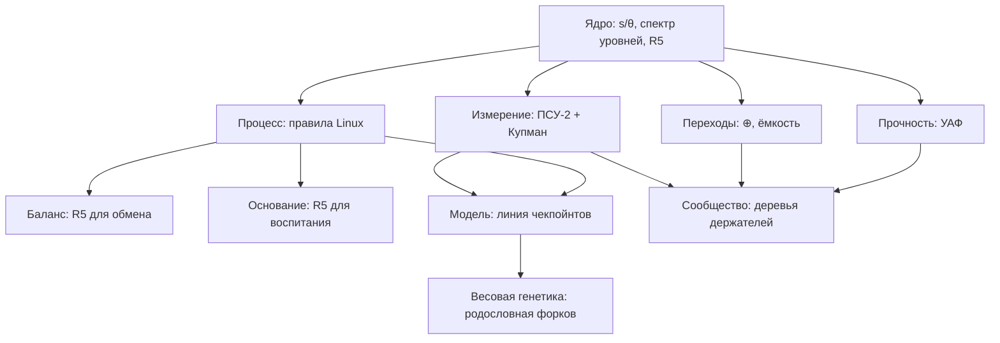

# Один проект: открытый ИИ по правилам Linux

Sep 21, 2026 · @Someone

## Итог

Пять веток — одно исследование с одним объектом: открытая линия языковых моделей, которую развивает сообщество без хозяина, и в которой уровни организации рождаются и держатся по одним правилам — внутри модели, в сообществе вокруг неё и в мире, который она предсказывает. Neu даёт язык и прибор, Спектральный предиктор — измерение, УАФ — прочность, ветка переходов — механизм, правила Linux — процесс, Баланс и Основание — приложения одного и того же правила приёмки к обмену и к воспитанию. Ни одна ветка не дублирует другую, и ни одна не держится сама по себе.

Стержень, переживший все проверки этой недели: **изменение принимается только по исходу в мире на заранее записанном горизонте**, а не по согласию системы с самой собой. Регулятор, принимавший изменения по совпадению «своего» уровня с мировым, убит предрегистрацией AUTO-01 (модель хуже на 13 % на шаге 1000). «Модель себя» в представлениях языковой модели не нашлась: ПСУ-3 на Pythia-70m — PY5 сработало, PY6 и PY7 нет, разрыв со случайной сид-копией +0,001. В ядре Linux решает не голосование, а регрессии. То же правило стоит в Балансе (оценка по исходу) и в Основании (долгий след M9, запрет центрального судьи 06 §10).

Поправка аудита 21.09 к прежней картине: на игрушечных трансформерах рождение уровня — настоящее явление, пережившее вычёркивание общего множителя, биграммный контроль и матчед-нуль; умерло только его приписывание «модели себя» — чужая сид-копия даёт то же самое. Прибор работает; работает он на мировую структуру, а не на «своё».

Легенда статусов (правило корпуса СБОРКА): **\[ЭМПИРИКА\]** — проверено предрегистрацией или данными; **\[ВЫВОД\]** — следует из проверенного; **\[ГИПОТЕЗА\]** — не проверялось; **\[АНАЛОГИЯ\]** — сходство формы анализа, не утверждение об одном механизме. Найденное после факта помечено словами «post hoc».

## Что объединяем

Объект один — открытый ИИ-проект: линия моделей (сейчас Pythia-класс для опытов), прибор уровней, сторож приёмки, протокол форков и сообщество, которое всё это развивает. Каждая ветка отвечает за свою часть; таблица показывает, какую именно и на чём это стоит.

| Ветка | Что это | Что вносит в проект | На чём стоит |
| --- | --- | --- | --- |
| Neu (уровни) | теория появления и удержания уровней организации | язык ядра и прибор — предсказательный спектр уровней в частной форме | \[ЭМПИРИКА\] EQUIV-01B: 2 признака без учителя дают 99 % потолка; BOUND-01: 49 вердиктов из 50; аудит 21.09 — рождение переживает контроли |
| Спектральный предиктор | операторы переноса Купмана, лебегово разложение спектра, прогноз рядов | измерительная подсистема: что в спектре измеримо (μ\_pp, μ\_ac), что нет (μ\_sc); прогноз с якорем персистентности | \[ЭМПИРИКА\] μ\_sc неуловима на трёх уровнях проверки; MASE 0,776 у ансамбля против 1,224 у ручных моделей |
| УАФ | законы обрушения сетей | подсистема прочности: спектральный порог обрушения, рычаг, порядок очереди | \[ЭМПИРИКА\] A0 = K0/λmax на 68+ сетях, RMS \~8 %; количественные законы каскадов на реальные данные не перенеслись |
| Переходы (CTF, моноид, оператор ⊕ из СБОРКИ) | почему единицы складываются в новую единицу | механизм рождения: связывание + усечение, ёмкость, конвертеры обмена | \[ЭМПИРИКА\] закон ёмкости и разгрузка вершины в Linux (H1, H2); \[ГИПОТЕЗА\] избыток M/E/I над связностью не доказан |
| Правила Linux | процедура без хозяина: патчи, мейнтейнеры, форки, публичный архив | процесс проекта — и одновременно предмет измерения тем же прибором | \[ЭМПИРИКА\] 1,37 млн коммитов: p90 нагрузки 410–625 в год за 18 лет, доля Линуса 30 % → 0,18 %; \[ГИПОТЕЗА\] перенос на институты |
| Баланс | экономика отзывов по исходу | правило приёмки R5 для обмена; доверие как несгораемый медленный параметр | \[ГИПОТЕЗА\] — корпус правил и репозиторий, эксперимента нет |
| Основание | воспитание «ребёнок + воспитатель + ИИ» без центра | правило R5 для воспитания; правила узла M1–M12 как ограничения протокола ИИ | \[ГИПОТЕЗА\]; одно ослабление доказано: единый прибор развёл порядок, край и хаос (BOUND-01) |
| Весовая генетика | веса моделей как популяционные данные | генеалогия форков модели: «открытая история собственных весов» | \[ГИПОТЕЗА\], протокол в исполнении |

Почему это один проект, а не сборник: три «одно». Один **объект** — модель, сообщество и мир, который модель предсказывает, описываются одной операцией «прошлое → будущее». Одно **сообщество** — те же люди и та же процедура ведут и модель, и теорию о ней. Одна **процедура приёмки** — R5, и она же является предметом проверки: если бы приёмка по согласию с собой работала, проект был бы устроен иначе; AUTO-01 и ПСУ-3 показали, что не работает.

Что не входит: доктрина для FDP — приложение той же рамки к политике; она берёт Баланс и Основание готовыми и здесь не разбирается. СБОРКА как корпус недоступна (исходники утеряны, память от 23.08); из неё берутся только примитив (s, θ), оператор ⊕ и правило маркировки утверждений.

## Ядро

Три определения и одно правило; всё остальное в проекте — их приложения. Как в ядре Linux правило «не ломаем userspace», эти четыре пункта меняются только новой версией теории, а не отдельным патчем.

**1. Система = (s, θ).** \[ВЫВОД, СБОРКА\] Быстрая переменная s и медленный параметр θ; граница между ними задаётся шкалой времени наблюдателя. Уровень N+1 — тот, для кого θ уровня N есть состояние s (УАФ: пол уровня N+1 = потолок уровня N). Отсюда главный урок августа: уровни принадлежат описанию, а не системе. Веса модели — θ для её активаций и s для сообщества, которое их меняет; правила сообщества — θ для сообщества. Linux — единственный известный институт с полностью открытой историей собственных θ (каждый патч — коммит в параметры института); открытая линия моделей с чекпойнтами — второй.

**2. Уровень — обнаружимое подпространство связи «прошлое → будущее».** \[ЭМПИРИКА для мостов — теоремы других авторов\] Десять систем описания уровней — ренормгруппа, метастабильность, Купман/VAMP, информационное горлышко, каузальные состояния, причинная эмерджентность, замыкание, эволюционные переходы, организации, LLM — одна операция: сингулярное разложение связи прошлого с будущим в выбранном словаре при выбранных Y и τ (мосты Э1–Э7 документа от 19.09; Э1 и Э5 перепроверены 21.09 численно до машинной точности). Расхождения между системами — всегда расхождения в Y, τ или словаре, а не в «природе уровней».

Прибор в рабочей форме: ρ\_k — k-я каноническая корреляция между состоянием X\_t и будущей целью Y\_{t+τ} после вычёркивания маргиналов Z; уровень — первые k\* направлений, где k\* стоит на наибольшем лог-разрыве среди мод выше перестановочного нуля; ширина разрыва — запас устойчивости числа уровней по компромиссу β гауссова IB (Э1).

```latex
k^{*}=\arg\max_{k:\;\rho_k>\rho_{\text{null}}}\;\log\frac{\rho_k}{\rho_{k+1}},\qquad \beta_k=\rho_k^{-2},\qquad w_k=2\log\frac{\rho_k}{\rho_{k+1}}
```

Поправка аудита: в определении ПСУ-2 слово «собственные» прогнозы лишнее. Цель строится по будущему мира или по предсказаниям любой обученной модели (они лишь сглаживают будущее: чужая сид-копия даёт то же подпространство и на игрушке, и на Pythia), а на реальных данных — только в частной форме. Без вычёркивания маргиналов нуль совпадения подпространств стоит на потолке (0,95–0,99 у предсказателя, не знающего ничего), и прибор годится только на опровержение.

**3. Рождение и удержание.** \[ЭМПИРИКА на игрушке; ГИПОТЕЗА для больших моделей и сообществ\] Рождение — подпространство состояния встаёт на скрытую структуру мира и после k-й моды открывается разрыв. На игрушечном трансформере (сиды 3–5) это шаги 750–1000: cos с 0,2 до 0,95, и 0,95 после вычёркивания общего множителя при нуле 0,1–0,2; в тот же момент тема становится читаемой (потолок R² переходит 0,5). Это переход типа BBP: мода выходит из-под порога обнаружимости n\* (Э7), та же математика, что в Спектральном предикторе (μ\_pp появляется в обучении, а не дана а priori). Удержание — разрыв держится в следующих окнах, признак прочности — гистерезис. В сообществе рождение промежуточного уровня совпадает с насыщением вершины (Linux 2009–2014, post hoc): доля патчей через два и более слияния 0,25 → 0,51, затем 11 лет плато.

**Правило приёмки R5.** \[ВЫВОД из ЭМПИРИКИ\] Изменение принимается, только если мировая метрика на свежих данных улучшилась на горизонте, записанном до проверки. Альтернативы проверены и мертвы:

| Альтернатива приёмке по исходу | Где проверена | Чем кончилось |
| --- | --- | --- |
| Принимать по совпадению своего уровня с мировым (регулятор R1–R3) | AUTO-01, 3 сида | модель хуже на 13 % на шаге 1000; совпадение и читаемость уровня растут, а лосс падает — мера Гудхарта |
| Опереться на «модель себя» внутри модели | ПСУ-2, ПСУ-3 на Pythia-70m; аудит на игрушке | привилегированного знания о себе нет: чужая сид-копия даёт то же (разрыв +0,001) |
| Центральный судья с единой мерой | Основание 06 §10; Linux (власть, не нагрузка) | центр рождает не измеримость, а монополия на вопрос и прибор; Линус делает 99,4 % слияний главной линии |
| Голосование | ядро Linux | не применяется никогда; решают регрессии и подпись ответственного |

Что в R5 заимствовано: сам принцип — правило регрессий ядра и отбор по бенчмарку в Darwin Gödel Machine. Своё — три добавки: горизонт и порог записываются до проверки (в AUTO-01 одни и те же добавки проходят на горизонте 2000 и не проходят на 1000); проверка против «тени» — того же мира без изменения, с тем же шумом (реализовано в игре «Экономика форков»); третий исход «разницы нет», при котором не откатывают.

## Подсистемы: куда встаёт каждый пазл

Каждая ветка подключается к ядру через явный интерфейс — что берёт на вход и что отдаёт остальным. Две вещи не подсистемы, а объекты измерения: модель и сообщество.



Ядро задаёт язык; четыре подсистемы — измерение, прочность, переходы, процесс — работают с двумя объектами (модель, сообщество); Баланс и Основание — приложения процесса к двум другим обменам.

| Подсистема | Вход | Выход | Кто потребляет выход |
| --- | --- | --- | --- |
| Измерение (Neu + Спектральный предиктор) | траектории X\_t; цель Y на шкале τ; маргиналы Z на вычёркивание | спектр ρ\_k, число уровней, разрыв, порог данных n\*, ошибка замыкания, направление подстройки | сторож R5, отчёты узлов Основания (M4), квартальные срезы сообщества |
| Прочность (УАФ) | граф: сеть узлов, граф общения сообщества | порог обрушения A0 = K0/λmax, рычаг, правило симметризации | «здоровье графа» сети узлов; устойчивость сообщества к уходу держателей |
| Переходы (CTF, ⊕) | единицы и их обмен; поток изменений | критерий новой единицы (связывание + усечение), ёмкость держателя, конвертер обмена | процесс (сколько держателей, где резать) |
| Процесс (правила Linux + сторож R5) | патчи с предрегистрацией; числа прибора | принято / откачено / разницы нет; индекс монополии; версии баз | модель, теория, Баланс, Основание, игра-песочница |

**Измерение.** Прибор из ядра плюс пять обязательных контролей, без которых число не принимается: перестановочный нуль по целым траекториям; матчед-нуль с сохранением маргиналов; чужой предсказатель; частная форма; положительный контроль с искусственно внесённым эффектом (он поймал 11 мод из 11 там, где честные варианты дают ноль). Уроки Спектрального предиктора входят сюда как границы: измеримы точечная и абсолютно непрерывная части спектра, сингулярно-непрерывная — нет (при β ≥ 0,75 неотличима от 1/f-шума); спектральные методы оправданы, только когда информативное направление неизвестно; для прогноза рядов работает якорь персистентности с ансамблем, а спектр даёт лишь детектор горизонта (+0,18 скилла от определения ранга). Статус: \[ЭМПИРИКА\] на эталонах и игрушке; на Pythia — слабо и только в частной форме (0,40 против 0,10 у биграммы).

**Прочность.** УАФ отвечает на вопрос, когда уровень ломается: порог A0 = K0/λmax с одной выведенной константой (K\* ≈ 0,157 на 68+ сетях семи областей, RMS \~8 %), рычаг out-influence, правило симметризации направленных сетей. В проекте он подключается к двум графам: сеть узлов Основания («здоровье графа»: кристалл, форк, пыль, живая сеть — по кратности единицы и близости собственных значений к ней) и граф маршрутизации сообщества (что случится с потоком при уходе держателя). Граница переноса известна и записана: иерархия (рычаг, спектральная хрупкость) переносится на реальные данные, точные законы каскадов (очередь, δ-порог) — нет. Статус: \[ЭМПИРИКА\] для порога; \[ГИПОТЕЗА\] для сетей узлов.

**Переходы.** Единицы складываются в новую, когда есть связывание и усечение (двусторонний критерий; корреляцию гонит конечная ёмкость, а не асимметрия цены) и конвертер обмена (генетический код, АТФ, деньги, язык). В проекте конвертер — единый формат патча с предрегистрацией: через него обмениваются форки, не имея общей живой ветки. Измеренный вклад в сообществе: закон ёмкости (держатель насыщается на 400–600 патчах в год, число держателей ≈ поток / 100–200), рождение промежуточного уровня при насыщении вершины. Открыто: прибавляет ли трёхосевая структура M/E/I что-то к одной связности (Сунский Китай объясним связностью), и когда именно уровень оформляется (прогноз по llama.cpp: 21 месяц вместо ≤ 12 — провал).

**Процесс.** Патч = дифф + предрегистрированная метрика с критерием провала + строка ресурсов + подписи конкретных людей + срок; один патч — одно изменение; молчание — не отказ, а эскалация. Мейнтейнер не автор в своём домене, срок ограничен, снятие — по доле подтверждённых регрессий; голосования нет. Сторож R5 — CI проекта. Протокол форков: базы заморожены версиями, баз несколько, индекс монополии публичен, сливающего нет — каждый узел сливает в свой форк. Проверено механически на синтетике (30 форков, 12 патчей: 77 из 78 принятий полезны; фильтр по доверенным отчётам сэкономил 100 проверок из 360; цена надбавки — полезный патч крупного источника приняли 5 форков из 30) и в игре «Экономика форков» — работающей песочнице этих правил на 214 странах (патчи с целями, тени, форки, ИИ за остальной мир). Статус: механика \[ЭМПИРИКА\]; перенос на живые институты \[ГИПОТЕЗА\].

**Баланс — R5 для обмена.** Провайдер или товар оценивается по исходу на горизонте, а не по мнению; доверие — несгораемый медленный параметр θ; потолок доли одного источника — тот же индекс монополии, что в протоколе форков; права выхода = права форка. Чтобы стать \[ЭМПИРИКОЙ\], нужна одна предрегистрация: на открытых данных отзывов исход-метрика предсказывает повторный выбор лучше звёздочек, с порогом и критерием убийства.

**Основание — R5 для воспитания.** Узел «ребёнок + воспитатель + ИИ» принимает методику только по долгому следу (M9); центрального судьи нет (06 §10), толкование — за узлом (M2); наружу — только числа (M4) — это федеративная форма прибора (суммы моментов); антимонополия M7; открытая методика M10 = открытый прибор; свободный выход = форк. Единственное уже измеренное: одна процедура развела порядок, край и хаос (BOUND-01), поэтому «единой метрики границы не существует — доказано» ослабляется до «мера зависит от вопроса», а отказ от судьи опирается на монополию на вопрос, а не на неизмеримость. Самое хрупкое — измеримы ли уровни Основания той же процедурой: прибору нужны сотни независимых реализаций, а жизнь у человека одна.

**Весовая генетика — родословная форков.** Чекпойнты и форки модели — популяция с открытой историей θ; вопрос ветки — какие статистики весов наследуются по линии форков и что в них отбирается. Интерфейс — те же идентификаторы патчей и версий баз, что в протоколе форков. \[ГИПОТЕЗА\], протокол в исполнении.

**Модель и сообщество — объекты.** У модели уровни — подпространства residual stream по шкалам τ; у сообщества — почти развязанные блоки маршрутизации «кто чем займётся дальше». В llama.cpp за 2025–26: 11 обнаружимых мод, разрыв после 9-й, почти все — аппаратные бэкенды, ставшие командами 15.03.2026; сигнал слабый (при 135 парах в 2024 — 0 мод), это предел n\*. Один прибор на оба объекта — \[АНАЛОГИЯ\] по форме анализа, не утверждение об одном механизме.

## Сам ИИ как объект

**Что именно разрабатывается.** Честный ответ на сегодня: не модель, а всё вокруг модели. Своей линии весов у проекта нет — для опытов взята чужая открытая линия с полной историей чекпойнтов (Pythia-70m-deduped и десять сидов PolyPythias, шаги 0 … 143 000), потому что прибору нужна именно открытая история θ, а не размер. Своё — четыре вещи: прибор (psu\_auto.py на numpy; psu3\_pythia\_colab.py с пятью контролями), сторож R5, протокол форков (Protocol.adopt: базы версиями, надбавка за долю источника, фильтр по доверенным отчётам) и песочница правил — игра «Экономика форков». Генератора полезных изменений нет: единственный кандидат, регулятор R1–R3, убит AUTO-01. Так что «разрабатываемый ИИ» сейчас — способ вести открытую линию моделей, а не новая модель; линией может стать любая, у которой открыты веса и чекпойнты. Собственная линия — первый крупный патч очереди (раздел «Как ведётся»), и до него проект остаётся прибором с протоколом.

**Что это меняет в устройстве модели.** Прежняя идея — модель ведёт своё улучшение, сверяя «модель себя» с миром — умерла дважды: регулятор по совпадению уровней ухудшил модель (AUTO-01), а самой «модели себя» в представлениях не нашлось (ПСУ-3: чужая сид-копия даёт то же подпространство, разрыв +0,001). \[ВЫВОД\] Улучшение — снаружи. Модель — объект, у которого измеряют уровни в частной форме и который принимает патчи по исходу; ей не нужно знать себя, нужно, чтобы её история была открыта. Самоулучшение ИИ = сообщество + сторож, а не интроспекция. Здесь ветки и сходятся: то, что для Neu было «поворотом самоописания к миру», для проекта — приёмка по исходу в мире. Что в модели измерять: уровни residual stream по шкалам τ (на Pythia — 0,40 после вычёркивания маргиналов против 0,10 у биграммы), их рождение по чекпойнтам и удержание между версиями; на реальных текстах — только частная форма, иначе нуль прибора стоит на потолке.

**«ИИ — это Linux для нагрузки, не для власти».** Ядро разгрузило вершину, но не отдало её: Линус применяет 0,18 % патчей (30 % в 2006), но делает 99,4 % из 43 535 слияний главной линии; живая главная ветка одна, и от неё зависят все дистрибутивы; основатель ведёт её с 1991 года. Основание требует иного — «общее открытое ядро, никем не владеемое» (15 §7) и «автор публикует протокол и уходит» (11 §6). Отсюда четыре правила «Linux без Линуса»:

1. База замораживается версиями. Форк опирается на опубликованную версию, а не на живую ветку; новая версия — предложение, которое узел принимает или нет.
2. Баз несколько, от разных авторов — «разные основатели» 11 §3.
3. Индекс монополии публичен: наибольшая доля одного источника среди принятых патчей и одной базы среди узлов. Сверх потолка — прогрессивная цена: чем больше доля, тем больший выигрыш нужен от следующего патча (в коде рост линейный, фонда разнообразия нет — грубый аналог M7).
4. Роли «сливающего» нет: каждый узел сливает только в свой форк. Автор базы уходит по 11 §6, и если автор базы — автор Основания, правило действует и на него.

Цена названа в самом Основании: «много маленьких моделей хуже одной большой» (15 §7) — давление к единой живой модели никуда не девается. Ответ проекта, данными не проверенный: без вершины координацию держит только обмен проверяемыми патчами, поэтому формат патча — несущая конструкция, а не оформление \[ГИПОТЕЗА\]. На синтетике протокол работает (77 полезных принятий из 78), но там же видна цена надбавки: полезный патч крупного источника приняли 5 форков из 30, а доля источника 0,40 всё ещё выше потолка 0,25.

**Роль ИИ в процессе.** В ядре Linux ИИ уже работает — как помощник, не как подписант. Sashiko рецензирует все патчи списка рассылки: на 1000 недавних ошибок, пропущенных людьми, он нашёл 53 % (замер автора, март 2026); к маю по его же подсчёту около 85 % замечаний подтверждаются, около 10 % ложные. AUTOSEL отбирает коммиты для стабильных ядер голосованием нескольких LLM — решает человек. Правило документации ядра: тег Assisted-by, Signed-off-by ставит только человек. Проект берёт это правило целиком: ИИ пишет патчи, рецензии и черновики предрегистраций; подпись под предрегистрацией и ответственность — человек; приёмку решает R5. Одна дыра остаётся открытой: R5 — автоматический порог, и кто отвечает за его ошибку, протокол пока не называет. Предложение: подпись мейнтейнера обязательна и при автоматическом прохождении — сторож не заменяет ответственного, а лишь запрещает принять без исхода \[открыто, не в коде\].

**Что теория предсказывает для такого проекта.** Сообщество вокруг модели — тот же объект для прибора, что и модель: цель Y — его собственная маршрутизация («кто и что будет обрабатывать дальше»), уровни — почти развязанные блоки этой маршрутизации. Шесть прогнозов из документа 19.09, каждый со своей опорой:

| Прогноз | На чём стоит | Статус | Чем опровергается |
| --- | --- | --- | --- |
| Уровень держателей растёт по закону ёмкости: число людей с правом слияния ≈ поток / (100–200 в год); p90 нагрузки держится в полосе 400–600 | Linux, предрегистрация H1 (410–625 за 18 лет); llama.cpp ≈ 113 в год на владельца | \[ЭМПИРИКА\] | p90 нагрузки вырос более чем втрое за 3+ года роста |
| Основатель уходит из прямой обработки: доля его слияний падает на два порядка | Linux, H2 (×172); llama.cpp: доля авторства 25,6 % → 12,1 % | \[ЭМПИРИКА\] для Linux, разведочно для llama.cpp | доля основателя не падает при росте потока ×3 |
| Промежуточный уровень рождается вместе с насыщением вершины: число прямых источников верхнего слияния выходит на плато, доля изменений через ≥ 2 уровня растёт до половины | Linux post hoc (плато \~170 деревьев с 2011; 0,25 → 0,51 за 2009–2014); llama.cpp: команды при 25–27 владельцах | post hoc; порядок «сначала насыщение» не доказан | команды множатся до плато владельцев |
| Разрезы идут по почти независимым блокам артефакта: бэкенды, конверсия форматов, сервер и инференс, мультимодальность, CI; самоописание видит их не позже формализации | llama.cpp, разведочно, сигнал слабый (11 мод при 2025–26, 0 при 135 парах в 2024) | \[ГИПОТЕЗА\] с одной разведкой | новая мода появляется после формализации, а не до |
| Удержание — кристаллизация: годовое перекрытие множества держателей выходит на 0,6–0,7, у участников остаётся низким; удержатся уровни при долгоживущих частях артефакта | Linux post hoc (0,30 в 2005/06, ≥ 0,6 с 2016/17; у авторов 0,26–0,34) | post hoc; часть о долгоживущих блоках не проверялась | перекрытие держателей не отличается от перекрытия авторов |
| Когда именно оформится формальный уровень — не предсказывает | прогноз по порогу ёмкости провалился: 21 месяц вместо ≤ 12 | \[ЭМПИРИКА\] отрицательная | кандидаты на триггер (ёмкость основателя, неформальные права) не проверены |

Что мерить по квартальным срезам — три числа: нагрузка на держателя; число прямых источников верхнего слияния; спектр самоописания «кто чем займётся дальше» с нулевой моделью. Как читать: рост первого сверх полосы 400–600 — уровню пора делиться; плато второго — время промежуточного уровня; новая мода выше порога в третьем — где пройдёт следующий разрез. Для проекта на старте (десятки участников) третий прибор молчит по построению — порог n\* не пройден, как в llama.cpp 2024 года; первые два работают с первого года.

Самое слабое в разделе — четвёртый прогноз и правило «Linux без Линуса» целиком: первое стоит на одной разведке, второе ни на чём, кроме синтетики и требований Основания. Оба идут в очередь патчей как предрегистрации, а не как утверждения.

## Реестр: установлено, мертво, открыто

Счёт по предрегистрациям на 21.09: EQUIV-01 и EQUIV-01B — из 15 проверок прошли 6 (P4, Q1, Q4, Q5, Q7, Q9), убиты или провалены 6 (P1, P2, P3, P5, Q2, Q6), одна не решена (Q3), одна пуста по построению (Q8), одна — только описание (P6, n\*); EQUIV-02 по Linux — 2 из 5, прогноз по llama.cpp провален (итого по первым работам 8 из 21, как в документе 19.09); AUTO-01 — 1 из 4 и сработало убийство; BOUND-01 — 3 из 3, убийство не сработало, 49 из 50 на новых сидах; ПСУ-2 на Pythia — формально 3 из 4, но два из трёх «да» держатся уже на шаге 0; ПСУ-3 — 0 из 3, сработало убийство PY5; PY8 не запускался. Q5 формально прошла, но аудит показал, что её признак держится и на инициализации — она в таблице «мертво». Всё, что найдено после факта, помечено.

**Установлено \[ЭМПИРИКА\]**

| Утверждение | Где | Числа |
| --- | --- | --- |
| Скрытый уровень находится без учителя двумя признаками; число уровней читается по разрыву; шкала τ меняет число уровней; работает на двух слоях сразу | EQUIV-01B, Q1, Q4, Q7, Q9 | 99,3 / 99,2 / 99,4 % потолка; разрыв после 2-й моды во всех сидах; τ = 1 — 16 мод, τ = 24 — 2 |
| Рождение уровня в обучении — настоящее явление, не артефакт нуля | аудит 21.09 на чекпойнтах сидов 3–5 | cos 0,2 → 0,95 к шагу 750–1000; после вычёркивания маргиналов 0,95 при нуле 0,1–0,2; биграмма 0,2 |
| Регулятор по совпадению уровней вредит; сторож «не хуже лучшей фиксированной ветви» держится | AUTO-01 (убийство, A2) | шаг 1000: 0,00810 против 0,00714 у базы (−13,4 %); AW −11,5 %, AS −95,5 % |
| Один прибор разводит порядок, край и хаос | BOUND-01, B1–B3; 10 новых сидов | 49 вердиктов из 50 (ошибка — хаотическая логистика) |
| Мосты между системами описания уровней точны | Э1, Э5 численно | 1 − ρ² до 8·10⁻¹⁶; сингулярные числа D\_π^{1/2} P D\_π'^{−1/2} = канонические корреляции цепи (0,617 / 0,364 / 0,259 против 0,620 / 0,365 / 0,260) |
| Закон ёмкости держателя; разгрузка вершины | Linux, H1, H2 | p90 410–625 патчей в год за 2008–2025 (×1,52 при пороге ×3), авторов ×2,07; доля Линуса 30,3 % → 0,18 % |
| Сингулярно-непрерывная часть спектра неизмерима; прогноз рядов держит якорь персистентности, а не спектр | Спектральный предиктор | μ\_sc при β ≥ 0,75 неотличима от 1/f на трёх уровнях проверки; MASE 0,776 у ансамбля против 1,224 у ручных моделей; спектр даёт детектор горизонта (+0,18 скилла) |
| Порог обрушения сети с одной константой | УАФ, 68+ сетей семи областей | A0 = K0/λmax, K\* ≈ 0,157, RMS \~8 % |
| Биграммный контроль ≡ юниграммный — теорема, не совпадение; на реальных текстах ПСУ-2 годен только в частной форме | ПСУ-3 на Pythia-70m | PY5: cos своя − биграмма = −0,007; частная форма 0,40 против 0,10 у биграммы и 0,03 у нуля |
| Протокол форков механически работает | синтетика: 30 форков, 12 патчей | 77 полезных принятий из 78; фильтр по доверенным сэкономил 100 проверок из 360 |
| Модель роста игры предсказывает вне выборки лучше наивных | бэктест 1999→2009 → 2009→2019 | RMSE 2,15 против 2,65 (своё прошлое) и 2,42 (среднее мира); корреляция 0,50; n = 118; прошлое окно 2,06 / 2,88 / 2,18 |

**Мертво**

| Утверждение | Чем убито | Что осталось |
| --- | --- | --- |
| Линейная версия системы уровней | EQUIV-01: P1 (R² 0,34 / 0,17 / 0,81 при пороге 0,80), P3 (SVD-ПЭ обошла в двух сидах) | ПСУ-2 с целью «увиденное ⊗ прогноз» |
| Инвариантность к координатам при предрегистрированном ридже | P2, Q6: Δ −0,08 … −0,01 и −0,05 … −0,02 | post hoc: при ридже 1e-10 Δ ≤ 0,0004 — численная гигиена, не принцип; не предрегистрировано |
| Рождение как пересечение нулевого порога | P5, Q8: ρ₂ выше порога уже при инициализации | рождение = совпадение подпространств + разрыв (подтверждено аудитом на игрушке) |
| Регулятор R1–R3 (генератор изменений по диагнозу прибора) | AUTO-01 | сторож R5; генератора нет |
| «Модель себя» в языковой модели как источник уровня | ПСУ-2 PY2 (0,883 < 0,9); ПСУ-3 PY6 (−0,003, 0,6σ), PY7 (0,395); аудит: чужая сид-копия даёт то же на игрушке | слово «собственный» из определения вычеркнуто |
| «Своя цель сильнее мировой» как признак уровня (Q5, PY3) | Δρ = +0,62 уже на инициализации; на Pythia — и на шаге 0 | Δρ ничего не различает |
| Совпадение и читаемость уровня как мера качества модели | AUTO-01 post hoc: cos 0,96–0,97 и R² 0,83–0,85 выше базы, лосс хуже | судья — только R5 |
| Глубина по цепочке подписей; удержание по стажу и Жаккару; разрыв спектра = число деревьев | Linux H3 (2,13 → 1,93), H4 (стаж 2 против 1; Жаккар 0,54), H5 (моды ≈ коммиттеры, Спирмен 0,94) | post hoc: глубина в графе слияний 0,12–0,32 → 0,47–0,52; кристаллизация 0,30 → 0,62–0,68 |
| Срок появления формального уровня по порогу ёмкости | llama.cpp: 21 месяц вместо ≤ 12 | закона для «когда» нет |
| Количественные законы каскадов (очередь, δ-порог) на реальных сетях | УАФ | переносится только иерархия: порог, рычаг, хрупкость |
| «Единой метрики границы не существует — доказано» | BOUND-01: одна процедура развела три режима | «мера зависит от вопроса»; отказ от судьи — из монополии на вопрос |

**Открыто**

| Вопрос | Ветка | Что нужно |
| --- | --- | --- |
| Уровни настоящей LLM в частной форме — сигнал 0,40 на 70m: растёт ли с размером и повторяется ли по сидам | Измерение | ПСУ-2 частная форма на 3 сидах PolyPythias и 160m; PY8 (запуск после удаления psu3\_rows.json) |
| Нелинейный словарь (128 кластеров: R² 0,90–0,93) и Q3 (SVD-ПЭ 0,81 против 0,64 в сиде 4) | Измерение | размер словаря подбирался на тех же сидах — нужна подтверждающая предрегистрация на новых |
| Помогают ли добавки к шагу 2000 (AW −9 %, AA −11 % в 2 из 3 сидов) | Процесс / R5 | ≥ 10 сидов, горизонт записан заранее |
| Порядок «насыщение вершины → промежуточный уровень»; кристаллизация как удержание | Переходы, Сообщество | предрегистрация на втором сообществе с открытой историей слияний |
| Триггер «когда» формального уровня: ёмкость основателя, неформальные права | Переходы | llama.cpp + 3–5 проектов GitHub, права коллабораторов по API |
| Разрезы по блокам артефакта — самоописание видит их до формализации | Измерение, Сообщество | порог n\*: нужны сотни пар «область → область» в окне; сейчас 0–2 моды в соседних окнах |
| Трёхосевая структура M/E/I против одной связности | Переходы | хотя бы один случай, где связность не объясняет, а M/E/I объясняет |
| «Здоровье графа» сети узлов по УАФ | Прочность, Основание | ни одного реального графа узлов не измерено |
| Исход-метрика предсказывает повторный выбор лучше звёздочек | Баланс | открытые данные отзывов, порог и критерий убийства до расчёта |
| Измеримы ли уровни узла Основания той же процедурой; протокол «наружу только числа» (M4) | Основание | реализация суммирования моментов в игре; данных о жизни нет и не предвидится |
| Наследуемость статистик весов по линии форков | Весовая генетика | протокол в исполнении; первый прогон — на чекпойнтах PolyPythias |
| Кто отвечает за ошибку автоматического R5 | Процесс | правило подписи (предложено в разделе выше), в коде нет |
| Протокол форков на живом сообществе, не на синтетике | Процесс | первый живой узел проекта |
| Идентичность по e-mail; сопоставимость патча (Linux) и склеенного PR (GitHub) | Сообщество | склейка псевдонимов; повторный счёт H1 по PR |

## Как проект ведётся: правила Linux, применённые к себе

Правила ядра берутся как процедура, а не как метафора; там, где данные по Linux расходятся с требованиями Основания, отступление названо (четыре правила раздела «Сам ИИ как объект»). Ниже — то, что можно завести завтра без единой новой идеи.

**Репозиторий.** Одна база, замороженная версиями (вторая появится, когда найдётся второй автор базы — правило 2):

- `theory/` — версионированная теория: `CORE.md` (четыре пункта ядра; меняется только версией), `bridges/` (Э1–Э7 с численной проверкой каждого), `REGISTRY.md` (реестр установлено/мертво/открыто — предыдущий раздел).
- `prereg/` — по файлу на проверку, заморожен до запуска; отчёт ссылается на хеш коммита предрегистрации.
- `instrument/` — psu\_common.py, psu\_auto.py, psu3\_pythia\_colab.py; число без пяти контролей прибором не считается.
- `results/` — JSON и ИТОГ-отчёты; отрицательные результаты хранятся наравне с положительными.
- `protocol/` — формат патча, Protocol.adopt, файл `MAINTAINERS`.
- `sandbox/` — «Экономика форков»: правила в исполняемом виде.
- `community/` — конвейеры по Linux и llama.cpp, квартальные срезы трёх чисел.

**Патч.** Один патч — одно изменение. Состав: дифф; утверждение с меткой \[ЭМПИРИКА\]/\[ВЫВОД\]/\[ГИПОТЕЗА\]/\[АНАЛОГИЯ\]; предрегистрированная метрика с порогом, критерием провала и горизонтом; строка ресурсов (часы GPU/CPU, данные); подписи — Author, Assisted-by (ИИ), Reviewed-by, Signed-off-by (человек-мейнтейнер); срок годности — не проверенный за два цикла патч возвращается в очередь. Молчание — не отказ, а эскалация к соседнему мейнтейнеру. Три исхода: принято, откачено, «разницы нет» (без отката, с записью в реестр).

**Мейнтейнеры.** По доменам, как в `MAINTAINERS` ядра: измерение, прочность, переходы, процесс, сообщество, песочница. Мейнтейнер не подписывает патчи в своём домене, если он их автор — нужна вторая подпись. Срок — четыре цикла, продление — отдельным патчем. Снятие — по доле подтверждённых регрессий среди подписанного, не голосованием. Пока в проекте один человек, все домены у него, и это записано как нарушение правила 4 с датой.

**Ритм.** Цикл 12 недель (у ядра 9–10): недели 1–2 — окно слияния предрегистраций, 3–10 — прогоны, 11–12 — реестр и версия теории. Каждая версия = снимок `REGISTRY.md` плюс изменения `CORE.md`, если были.

**CI = критерии убийства.** Критерий провала каждой принятой проверки становится тестом: смена прибора обязана воспроизвести все прежние вердикты на сохранённых чекпойнтах (сиды 0–5, BOUND-01, ПСУ-3). Патч к прибору, меняющий прошлый вердикт, — регрессия по определению: он либо откатывается, либо идёт как новая версия теории с явной записью, что именно перестало быть верным. Это аналог «не ломаем userspace»: не ломаем реестр.

**Форки = альтернативные гипотезы.** Форк — не раскол, а параллельная предрегистрация с другим словарём, целью или τ; обмен между форками — только патчами того же формата, без общей живой ветки. Индекс монополии (доля одного источника среди принятых патчей) публикуется в каждой версии; сейчас он равен 1,0.

**Роль ИИ.** Как в ядре: Assisted-by, никогда Signed-off-by. ИИ пишет черновики патчей, прогоны и рецензии; рецензия ИИ обязательна до человеческой (как Sashiko в списке рассылки), но не заменяет её. Всякое число, полученное ИИ, сопровождается скриптом воспроизведения в `results/`; этот документ — пример: аудит 21.09 пересчитал числа Opus по файлам, а не по тексту.

**Очередь ближайших патчей** (порядок — по цене ответа за час работы):

| № | Патч | Метрика и критерий провала (в предрегистрацию) | Ресурсы |
| --- | --- | --- | --- |
| 1 | PY8 «собственный остаток» на Pythia-70m — скрипт готов, нужен повторный запуск после удаления psu3\_rows.json | моды своя − чужая ≥ 2 хотя бы в одной ячейке; провал — ≤ 1 везде, ветка «модели себя» закрывается окончательно | Colab, \~10 мин |
| 2 | ПСУ-2 в частной форме на трёх сидах PolyPythias и на Pythia-160m | partial cos своя против биграммы ≥ 0,5 на шаге 143 000 в ≥ 2 сидах из 3; провал — < 0,3; растёт ли сигнал с размером — разведочно | Colab, \~30 мин на сид |
| 3 | Нелинейный словарь: сиды 6–8, размер 128 зафиксирован заранее | 2 признака ≥ 95 % потолка того же словаря во всех сидах; провал — < 85 % хотя бы в одном | CPU/JAX, три обучения по 8000 шагов |
| 4 | AUTO-02: мировая добавка на горизонте 2000, 10 сидов | AW лучше A0 на шаге 2000 на ≥ 0,0005 в ≥ 7 сидах; провал — ≤ 5; горизонт 1000 записан как «не ждём» | CPU, 20 прогонов |
| 5 | WORM-01: прибор уровней на открытых записях активности нейронов C. elegans (whole-brain imaging) | k\* ≥ 2 мод над нулём с разрывом у ≥ 3 червей из 5; провал — ни одной моды у 4 из 5 | открытые данные, CPU |
| 6 | УАФ Q102: реплика провала спектральной специфичности очереди на втором наборе (Digg 2009 или Sina Weibo) | степенная центральность снова обходит собственный вектор — закон очереди снимается; иначе Higgs — частный случай | данные вручную, CPU |
| 7 | Основание в песочнице: узел отдаёт наружу только числа (M4) — суммы моментов вместо траекторий | вердикты прибора по федеративным суммам совпадают с вердиктами по полным данным в ≥ 90 % случаев BOUND-01; провал — < 75 % | код игры, CPU |
| 8 | Баланс R5: открытые данные отзывов | исход-метрика предсказывает повторный выбор лучше среднего балла на ≥ 0,05 AUC; провал — разницы нет на двух наборах | открытые наборы отзывов, CPU |
| 9 | Весовая генетика: наследуемость статистик весов по линии форков на Lots-of-LoRAs (протокол B) и на чекпойнтах PolyPythias | по протоколу B, как записано в его предрегистрации | Kaggle |
| 10 | Квартальный срез сообщества проекта — три числа с первого дня | без порога: измерение, не проверка; порог появится, когда n\* пройден | скрипт, минуты |

Первые четыре патча закрывают или открывают вопрос о реальной LLM; пятый и шестой — самые дешёвые проверки того, что прибор и УАФ работают вне своих родных данных; седьмой и восьмой переводят Основание и Баланс из \[ГИПОТЕЗЫ\] хотя бы в одну проверку; девятый идёт своим протоколом; десятый — первое применение теории к самому проекту.

## Самые хрупкие допущения объединения

Пять допущений, на которых держится именно объединение, а не отдельные ветки; порядок — от самого опасного. У каждого записано, что именно распадётся, если оно неверно, — чтобы провал не пересказывали как успех.

| № | Допущение | На чём держится сейчас | Если неверно | Где проверяется |
| --- | --- | --- | --- | --- |
| 1 | У каждого приложения R5 есть мировая метрика на горизонте, который можно дождаться внутри цикла | для модели — да (лосс на свежих данных); для сообщества — кварталы; для Баланса — повторный выбор; для Основания — годы (M9) | там, где горизонт длиннее цикла, приёмка сползает на прокси — ровно та ловушка Гудхарта, которую показал AUTO-01; R5 верно, но неприменимо, и Основание с Балансом остаются корпусами правил без прибора | патчи 7, 8; квартальные срезы (10) |
| 2 | Цель «увиденное ⊗ прогноз» в частной форме достаточна для реальных текстов с длинной памятью | игрушка с памятью первого порядка — 99 % потолка; Pythia-70m — 0,40 против 0,10 у биграммы, один сид, один размер | прибор остаётся игрушечным; линия моделей теряет свой измеритель, и проект сводится к протоколу без прибора; нужны длинные пары или нелинейный словарь, и растёт n\* | патчи 1–3 |
| 3 | Один прибор на модель и сообщество — не только аналогия по форме | Linux: моды ≈ числу коммиттеров, отдельного разрыва нет (H5); llama.cpp — 11 мод в одном окне и 0–2 в соседних | часть о сообществе сводится к закону ёмкости и разгрузке вершины — двум числам вместо трёх; «один объект» из раздела «Что объединяем» становится двумя | патч 10 на горизонте лет; второе сообщество с открытой историей слияний |
| 4 | «Linux без Линуса» вообще координирует: замороженные базы и обмен патчами без сливающего дают живую линию, а не пыль | синтетика (30 форков) и игра; единственные реальные данные говорят обратное: Linux живёт с одной живой линией и одним сливающим 35 лет | проект вырождается в обычный открытый проект с вершиной — в Linux с Линусом; требования 15 §7 и 11 §6 оказываются невыполнимы для линии моделей, и это придётся записать в Основание как границу | первый живой форк с вторым автором базы; индекс монополии ниже 1,0 |
| 5 | Уровни узла Основания измеримы той же процедурой | только BOUND-01 на эталонах; процедуре нужны сотни независимых реализаций, а жизнь у человека одна; «своё описание» узла — текст, не вероятности | Основание остаётся языком суждения, как предупреждает 06 §5; в проекте от него остаются только правила протокола (M4, M7, M10, выход = форк), а не предмет измерения | патч 7 — только часть про M4; проверки на жизни не предвидится |

Мельче, но записано: идентичность по e-mail в сообществах (стаж занижен); патч в Linux и склеенный PR на GitHub — разные единицы; все положительные результаты о модели получены на трансформере в 2 слоя и d = 64, и ни один — на модели больше 70m; числа Спектрального предиктора и УАФ взяты из их собственных отчётов и в аудите 21.09 не пересчитывались.

Что не хрупко: само ядро. Определение уровня через связь «прошлое → будущее» стоит на теоремах других авторов и перепроверено численно; рождение уровня на игрушке пережило все контроли; R5 — единственное правило приёмки, у которого все альтернативы проверены и мертвы. Если распадутся все пять допущений, останется прибор для обучаемых моделей и правило приёмки — меньше, чем хотелось, но больше, чем было в августе.

## Источники

**Свои документы, код и данные**

- «Основание и уровни: общая система, автоулучшение LLM и проверка на Linux» — документ от 19.09.2026, разделы 1–12: мосты Э1–Э7, EQUIV-01/01B, AUTO-01, BOUND-01, EQUIV-02, llama.cpp, шесть прогнозов.
- АУДИТ-01 (21.09.2026) — пересчёт чисел и мостов, контроли ПСУ-3 на чекпойнтах сидов 3–5; скрипты audit\_toy.py, audit\_bridges.py, read\_psu3.py.
- Предрегистрации: PREREG-EQUIV, PREREG-EQUIV-B, PREREG-AUTO-01, PREREG-BOUND-01, PREREG-PSU3-01; отчёты ITOG-PSU-01, таблицы ПСУ-2 и ПСУ-3 с Colab (сентябрь 2026).
- Код прибора и протокола: psu\_auto.py (прибор, регулятор, Protocol.adopt), psu\_common.py, psu3\_pythia\_colab.py.
- [Игра «Экономика форков»](https://claude.ai/artifact/CCTLiGQoZgcRpoj23mDV7M) — песочница правил, модель Мир-2.1.2, бэктест backtest\_growth3.json.
- [Foundation 1.3 (Основание)](https://github.com/131ymm-commits/Foundation-1.3) — правила узла M1–M12, 06 §5 и §10, 11 §3 и §6, 15 §7.
- [Репозитории УАФ](https://github.com/131ymm-commits/) — v5.2-final (Q20–Q39) и UAF-6.0 (Q40+): закон A0 = K0/λmax, рычаг, очередь на Higgs Twitter, дуга Q89–Q101.
- Баланс (balance-en), весовая генетика (протокол B, Lots-of-LoRAs), Спектральный предиктор, CTF — по их собственным отчётам; числа в аудите 21.09 не пересчитывались.
- СБОРКА — исходники недоступны (память от 23.08.2026); взяты примитив (s, θ), оператор ⊕ и правило маркировки.

**Linux и ИИ**

- [AI Coding Assistants](https://docs.kernel.org/process/coding-assistants.html) — документация ядра (Assisted-by; Signed-off-by только человек); [патч Саши Левина от 23.12.2025](https://patchew.org/linux/20251223122110.2496946-1-sashal@kernel.org/).
- [The Sashiko patch-review system](https://lwn.net/Articles/1063292/) — LWN, 17.03.2026 (53 % из 1000 пропущенных ошибок).
- [Reviewing kernel patches with LLMs](https://lwn.net/Articles/1073583/) — LWN, 25.05.2026 (на 1500 ветках переписки: около 10 % ложных, около 85 % подтверждённых, почти 97 % для критичных — замер автора).
- [Supporting kernel development with large language models](https://lwn.net/Articles/1026558/) — LWN, 26.06.2025 (AUTOSEL).
- [Linux Foundation: Agentic AI Foundation](https://www.linuxfoundation.org/press/linux-foundation-announces-the-formation-of-the-agentic-ai-foundation) — 09.12.2025.
- [CHAOSS Metrics in 2026](https://nesbitt.io/2026/05/27/chaoss-metrics-in-2026.html) — Andrew Nesbitt, 27.05.2026.
- [история Linux](https://github.com/torvalds/linux) (1 371 255 коммитов, 43 535 слияний); [история llama.cpp](https://github.com/ggml-org/llama.cpp) (11 053 коммита, 56 версий CODEOWNERS).

**Модели для опытов и их свойства**

- [Pythia: A Suite for Analyzing Large Language Models Across Training and Scaling](https://arxiv.org/abs/2304.01373) — Biderman и др., ICML 2023 (открытые чекпойнты 0 … 143 000).
- [PolyPythias: Stability and Outliers across Fifty Language Model Pre-Training Runs](https://arxiv.org/abs/2503.09543) — van der Wal и др., ICLR 2025 (сид-копии; seed1 — недедуплицированные данные).
- [Why do small language models underperform? Studying Language Model Saturation via the Softmax Bottleneck](https://arxiv.org/abs/2404.07647) — Godey, de la Clergerie, Sagot, COLM 2024 (насыщение малых Pythia — основание выбора шага 64 000).
- [Neural Networks Learn Statistics of Increasing Complexity](https://arxiv.org/abs/2402.04362) — Belrose и др., ICML 2024 (модели сначала учат низкие моменты — почему биграммный контроль обязателен).
- [Characterizing Learning Curves During Language Model Pre-Training](https://arxiv.org/abs/2308.15419) — Chang, Tu, Bergen, TACL 2024 (стабильность кривых обучения Pythia по сидам).

**Автоулучшение и направленность**

- [The Belief State Transformer](https://arxiv.org/abs/2410.23506) — Hu и др., ICLR 2025.
- [Better & Faster Large Language Models via Multi-token Prediction](https://arxiv.org/abs/2404.19737) — Gloeckle и др., ICML 2024.
- [LLM-JEPA](https://arxiv.org/abs/2509.14252) — Huang, LeCun, Balestriero, ICLR 2026.
- [Next-Latent Prediction Transformers Learn Compact World Models](https://arxiv.org/abs/2511.05963) — Teoh, Tomar, Ahn и др.; препринт, не рецензирован.
- [Darwin Gödel Machine](https://arxiv.org/abs/2505.22954) — Zhang и др., ICLR 2026.
- [Building Machine Learning Models Like Open Source Software](https://cacm.acm.org/opinion/building-machine-learning-models-like-open-source-software/) — Raffel, CACM, 2023.
- [Granger causality and transfer entropy are equivalent for Gaussian variables](https://arxiv.org/abs/0910.4514) — Barnett, Barrett, Seth, PRL 2009.
- [Speaker gaze increases information coupling between infant and adult brains](https://pmc.ncbi.nlm.nih.gov/articles/PMC5740679) — Leong и др., PNAS 2017.

**Уровни в LLM**

- [Shai и др., NeurIPS 2024](https://arxiv.org/abs/2405.15943) — геометрия belief-состояний в residual stream.
- [Lad, Gurnee, Tegmark, 2024](https://arxiv.org/abs/2406.19384) — препринт.
- [Cheng и др., ICLR 2025](https://arxiv.org/abs/2405.15471)
- [Hoogland и др., TMLR 2025](https://arxiv.org/abs/2402.02364)
- [Paulo, Belrose, ICLR 2026](https://arxiv.org/abs/2501.16615)
- [Dhor, Chen, 2026](https://arxiv.org/abs/2608.10172) — препринт.

**Мосты между системами описания**

- [Chechik, Globerson, Tishby, Weiss, JMLR 2005](https://www.jmlr.org/papers/v6/chechik05a.html) — гауссов IB (Э1).
- [Wu, Noé, J Nonlinear Sci 2020](https://arxiv.org/abs/1707.04659); [Mardt, Pasquali, Wu, Noé, Nat Commun 2018](https://www.nature.com/articles/s41467-017-02388-1) — VAMP (Э5).
- [Deuflhard, Weber, Linear Algebra Appl 2005](https://www.sciencedirect.com/science/article/pii/S0024379504004689); [Sarich, Noé, Schütte, Multiscale Model Simul 2010](http://publications.imp.fu-berlin.de/771/1/MSM_submitted.pdf) — метастабильность.
- [Still, Crutchfield, Ellison, Chaos 2010](https://arxiv.org/abs/0708.1580); [Shalizi, Moore](https://arxiv.org/abs/cond-mat/0303625) — каузальные состояния.
- [Koch-Janusz, Ringel, Nature Physics 2018](https://www.nature.com/articles/s41567-018-0081-4); [Gordon, Banerjee, Koch-Janusz, Ringel, PRL 2021](https://arxiv.org/abs/2012.01447) — ренормгруппа и IB.
- [Zhang и др., npj Complexity 2025](https://www.nature.com/articles/s44260-025-00028-0) — причинная эмерджентность через SVD.
- [Bao, Hu, Pan, Zhou, Ann Stat 2019](https://arxiv.org/abs/1704.02408) — порог обнаружимости канонических корреляций (Э7).
- Классика без ссылок: Kemeny, Snell, *Finite Markov Chains* (1960); Simon, *The Architecture of Complexity* (1962); Crutchfield, *The Calculi of Emergence* (1994); Hoel, Albantakis, Tononi (PNAS 2013).

**Эволюция и организации**

- [Black, Bourrat, Rainey, Nat Ecol Evol 2020](https://www.nature.com/articles/s41559-019-1086-9) — экологический шаблон переходов индивидуальности.
- [Zhou и др., FSE 2017](https://dl.acm.org/doi/abs/10.1145/3106237.3106287) — нагрузка на мейнтейнера Linux 2009–2017 не растёт.
- [Модель нескольких коммиттеров, FSE 2019](https://dl.acm.org/doi/10.1145/3338906.3342490); [масштабирование open source, ICSE 2020](https://dl.acm.org/doi/10.1145/3377811.3380920).

Препринты помечены как препринты; на них в этом документе не стоит ни одно утверждение со статусом \[ЭМПИРИКА\].
